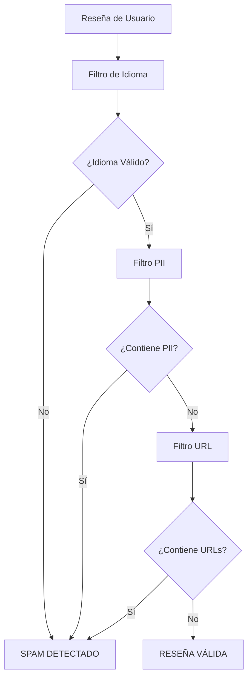

# 🔮 NoFakingWay - Sistema de Detección de Reseñas Falsas y Spam

<p align="center">
  
</p>

<div align="center">

[]()
[](/LICENSE)
[]()
[]()

</div>

---

<p align="center">
Sistema inteligente para la detección automática de reseñas falsas y contenido spam en plataformas de e-commerce
</p>

## 📋 Tabla de Contenidos

- [Acerca del Proyecto](#acerca-del-proyecto)
- [Características](#características)
- [Arquitectura del Sistema](#arquitectura-del-sistema)
- [Instalación](#instalación)
- [Uso](#uso)
- [Filtros Implementados](#filtros-implementados)
- [API y Estructura](#api-y-estructura)
- [Ejemplos](#ejemplos)
- [Contribuir](#contribuir)
- [Autores](#autores)

## 🧐 Acerca del Proyecto

**NoFakingWay** es un sistema avanzado de detección de reseñas falsas y spam diseñado específicamente para plataformas de e-commerce como Amazon, Yelp, y otros marketplaces online. 

### 🎯 Problema que Resuelve

Las reseñas falsas y el spam representan un problema crítico en el comercio electrónico:
- **Pérdida de confianza** del consumidor
- **Competencia desleal** entre vendedores
- **Decisiones de compra erróneas** basadas en información falsa
- **Degradación de la calidad** de la plataforma

### 💡 Nuestra Solución

Implementamos un sistema de filtros múltiples que analiza automáticamente cada reseña a través de diferentes capas de validación, identificando patrones sospechosos y contenido potencialmente fraudulento.

## ✨ Características

### 🔍 **Detección Multicapa**
- **Análisis de idioma**: Detecta contenido sin sentido y idiomas no soportados
- **Filtro PII**: Identifica información personal sospechosa
- **Detección de URLs**: Marca reseñas con enlaces externos

### 🚀 **Interfaz de Usuario**
- **Aplicación web interactiva** con Streamlit
- **Validación en tiempo real** de reseñas
- **Ejemplos predefinidos** para testing
- **Visualización clara** de resultados

### 🛠️ **Arquitectura Modular**
- **Filtros independientes** y reutilizables
- **Fácil extensión** con nuevos filtros
- **API REST ready** para integración

### 📊 **Análisis Detallado**
- **Puntuación de confianza** para cada reseña
- **Razones específicas** de detección
- **Formato JSON** para integración con sistemas externos

## 🏗️ Arquitectura del Sistema

```
NoFakingWay/
├── streamlit/
│   └── demo_streamlit.py      # Aplicación web principal
├── filters/
│   ├── Lang/
│   │   └── Lang_filter.py     # Filtro de idioma
│   ├── PII/
│   │   └── PII_filter.py      # Filtro de información personal
│   └── URL/
│       └── URL_filter.py      # Filtro de URLs
├── requirements.txt           # Dependencias del proyecto
└── README.md                 # Documentación
```

### 🔄 Flujo de Procesamiento



## 🚀 Instalación

### Prerrequisitos

- Python 3.7 o superior
- pip (gestor de paquetes de Python)

### Instalación Paso a Paso

1. **Clonar el repositorio**
   ```bash
   git clone https://github.com/tu-usuario/NoFakingWay.git
   cd NoFakingWay
   ```

2. **Crear entorno virtual (recomendado)**
   ```bash
   python -m venv venv
   source venv/bin/activate  # En Windows: venv\Scripts\activate
   ```

3. **Instalar dependencias**
   ```bash
   pip install -r requirements.txt
   ```

4. **Descargar modelo de idioma de spaCy**
   ```bash
   python -m spacy download en_core_web_sm
   ```

### Verificación de Instalación

```bash
python -c "import spacy; import streamlit; print('✅ Instalación exitosa')"
```

## 🎈 Uso

### Aplicación Web (Recomendado)

Ejecutar la aplicación Streamlit:

```bash
streamlit run streamlit/demo_streamlit.py
```

La aplicación estará disponible en: `http://localhost:8501`

### Uso Programático

```python
import sys
import os

# Cargar filtros
sys.path.append('filters')
from PII.PII_filter import PII_filter, regex_dict
from Lang.Lang_filter import Lang_filter, create_language_detection_model
from URL.URL_filter import URL_filter

# Inicializar modelo de idioma
language_model = create_language_detection_model()

def validate_review(review_text):
    """
    Valida una reseña a través de todos los filtros
    """
    # Filtro de idioma
    result = Lang_filter(language_model, review_text)
    if result['suspicious']:
        return result
    
    # Filtro PII
    result = PII_filter(review_text, regex_dict)
    if result['suspicious']:
        return result
    
    # Filtro URL
    result = URL_filter(review_text)
    return result

# Ejemplo de uso
review = "La comida estaba muy buena, recomendado!"
result = validate_review(review)
print(result)
```

## 🛡️ Filtros Implementados

### 1. 🌐 Filtro de Idioma (`Lang_filter`)

**Propósito**: Detecta contenido sin sentido y idiomas no soportados

**Configuración**:
- **Idiomas permitidos**: Español, Inglés, Francés
- **Umbral de confianza**: 70%

**Casos detectados**:
- Texto sin sentido: `iweoefivhe edfgiowe ieini efwef`
- Idiomas no soportados: Alemán, Italiano, etc.
- Texto con caracteres aleatorios

### 2. 🔒 Filtro PII (`PII_filter`)

**Propósito**: Detecta información personal que podría indicar spam

**Patrones detectados**:
- **Emails**: `ejemplo@gmail.com`
- **Teléfonos**: Españoles, franceses, británicos
- **Documentos de identidad**: DNI, NIE, INSEE, etc.
- **Tarjetas de crédito**: Números de tarjeta
- **Cuentas bancarias**: IBAN, SWIFT
- **Redes sociales**: @usuario

### 3. 🌐 Filtro URL (`URL_filter`)

**Propósito**: Detecta enlaces externos sospechosos

**Casos detectados**:
- URLs completas: `https://ejemplo.com`
- Dominios: `ejemplo.com`
- Enlaces acortados: `bit.ly/xxx`

## 📡 API y Estructura de Respuesta

### Formato de Entrada

```json
{
    "product_id": "uuid-del-producto",
    "user_id": "uuid-del-usuario", 
    "review": "Texto de la reseña",
    "value": 5
}
```

### Formato de Respuesta

#### Reseña Válida
```json
{
    "suspicious": false,
    "filter_failed": "",
    "motive": ""
}
```

#### Reseña Sospechosa
```json
{
    "suspicious": true,
    "filter_failed": "Personal information",
    "motive": "email, Spanish phone number"
}
```

## 📚 Ejemplos

### Ejemplos Incluidos en la Aplicación

1. **Reseña válida**: `"La comida estaba muy buena"`
2. **Texto sin sentido**: `"iweoefivhe edfgiowe ieini efwef"`
3. **Información personal (1)**: `"Mi numero de telefono es el 690312141"`
4. **Información personal (2)**: `"Mi mail es sdsdf@gmail.com"`

### Casos de Uso Comunes

```python
# Caso 1: Reseña legítima
review1 = "Excelente producto, muy recomendable. Llegó rápido y en perfectas condiciones."
result1 = validate_review(review1)
# Result: {'suspicious': False, 'filter_failed': '', 'motive': ''}

# Caso 2: Spam con teléfono
review2 = "Producto regular. Para más info llama al 612345678"
result2 = validate_review(review2)
# Result: {'suspicious': True, 'filter_failed': 'Personal information', 'motive': 'Spanish phone number'}

# Caso 3: Contenido sin sentido
review3 = "asdfgh qwerty zxcvbn"
result3 = validate_review(review3)
# Result: {'suspicious': True, 'filter_failed': 'Filler', 'motive': 'Nonsense language'}
```

## 🔧 Configuración Avanzada

### Personalizar Idiomas Permitidos

Editar `filters/Lang/Lang_filter.py`:

```python
# Línea 9
ALLOWED_LANGUAGES = ['en', 'fr', 'es', 'de']  # Agregar alemán
```

### Ajustar Umbral de Detección

```python
# Línea 11
TRESH_DETECTION = 0.8  # Más estricto (80%)
```

### Agregar Nuevos Patrones PII

Editar `filters/PII/PII_filter.py`:

```python
regex_dict['nuevo_patron'] = r"tu-expresion-regular-aqui"
```

## 🚀 Extensiones Futuras

### Filtros Adicionales Sugeridos

1. **Filtro de Sentimiento**: Detectar reseñas extremadamente positivas/negativas
2. **Filtro de Duplicados**: Identificar reseñas idénticas o muy similares
3. **Filtro de Velocidad**: Detectar usuarios que publican muchas reseñas rápidamente
4. **Filtro de Coherencia**: Verificar coherencia entre puntuación y texto

### Integraciones

1. **API REST**: Crear endpoints para integración externa
2. **Base de datos**: Almacenar historial de reseñas analizadas
3. **Machine Learning**: Implementar modelos de clasificación avanzados
4. **Análisis en lote**: Procesamiento de grandes volúmenes

## 🤝 Contribuir

### Cómo Contribuir

1. **Fork** el repositorio
2. **Crear** una rama para tu feature (`git checkout -b feature/AmazingFeature`)
3. **Commit** tus cambios (`git commit -m 'Add some AmazingFeature'`)
4. **Push** a la rama (`git push origin feature/AmazingFeature`)
5. **Abrir** un Pull Request

### Guías de Contribución

- **Código limpio**: Seguir PEP 8
- **Documentación**: Documentar nuevas funciones
- **Tests**: Agregar tests para nuevas funcionalidades
- **Compatibilidad**: Mantener compatibilidad con Python 3.7+

## 📄 Licencia

Este proyecto está bajo la Licencia MIT - ver el archivo [LICENSE](LICENSE) para más detalles.

## ✍️ Autores

- **[@Amloii](https://github.com/Amloii/)** - Idea y desarrollo inicial

---

## 🙏 Agradecimientos

- **spaCy** - Por el procesamiento de lenguaje natural
- **Streamlit** - Por la interfaz web interactiva
- **Comunidad Open Source** - Por las librerías y herramientas utilizadas

---

<div align="center">

**¿Te gusta el proyecto? ¡Dale una ⭐ al repositorio!**

</div>